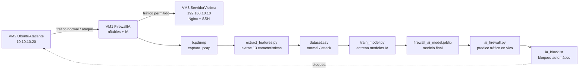

# Firewall con IA — Explicación breve del laboratorio

Este repositorio contiene la implementación de un **firewall con inteligencia artificial** desarrollado en VirtualBox.  
La idea principal es que el firewall no solo bloquee por reglas fijas, sino que también use un modelo de IA para detectar tráfico sospechoso y bloquear automáticamente la IP atacante.

---

## 1. ¿Qué se hizo?

Se construyó un laboratorio con **3 máquinas virtuales**:

| Máquina | Rol | IP |
|---|---|---|
| VM1 FirewallIA | Firewall, captura de tráfico, IA y bloqueo con `nftables` | `10.10.10.1` y `192.168.10.1` |
| VM2 UbuntuAtacante | Genera tráfico normal y ataques controlados | `10.10.10.20` |
| VM3 ServidorVictima | Servidor protegido con Nginx y SSH | `192.168.10.10` |

La VM1 funciona como puente de seguridad entre la VM2 y la VM3.

---

## 2. Gráfico general del funcionamiento



---

## 3. ¿Qué contiene el repositorio?

```text
firewall-ia-lab/
├── nftables.conf
├── extract_features.py
├── train_model.py
├── ai_firewall.py
├── requirements.txt
├── data/
├── models/
├── systemd/
│   └── ai-firewall.service
└── informe/
```

---

## 4. ¿Qué hace cada archivo?

| Archivo / carpeta | Explicación sencilla |
|---|---|
| `nftables.conf` | Contiene las reglas del firewall. Usa política restrictiva y un set dinámico llamado `ia_blocklist`. |
| `extract_features.py` | Lee capturas `.pcap` y convierte el tráfico en datos numéricos para IA. |
| `train_model.py` | Entrena modelos de clasificación y guarda el modelo final. |
| `ai_firewall.py` | Ejecuta la IA en vivo. Si detecta ataque, bloquea la IP en `nftables`. |
| `requirements.txt` | Lista las librerías de Python necesarias. |
| `data/` | Guarda capturas `.pcap` y archivos `.csv` del dataset. |
| `models/` | Guarda el modelo entrenado, scaler, métricas e importancia de características. |
| `systemd/ai-firewall.service` | Permite ejecutar la IA como servicio automático del sistema. |
| `informe/` | Carpeta para guardar el informe final y evidencias. |

---

## 5. Flujo realizado en la práctica

### Paso 1: Configurar el firewall clásico

En la VM1 se configuró `nftables` con:

- política `drop`;
- reglas para permitir solo servicios necesarios;
- logs con `NFT-DROP`;
- set dinámico `ia_blocklist`.

Esto permite que el firewall bloquee puertos no autorizados.

---

### Paso 2: Capturar tráfico normal

Se capturó tráfico permitido desde VM2 hacia VM3:

- `ping`;
- `curl` hacia Nginx;
- tráfico HTTP normal.

Archivo generado:

```text
data/traffic-normal.pcap
```

---

### Paso 3: Capturar tráfico de ataque

Se generaron ataques controlados desde VM2:

```bash
sudo nmap -Pn -sS -p 1-1000 192.168.10.10
sudo hping3 -S -p 80 -c 4000 -i u10000 192.168.10.10
for i in {1..80}; do
  ssh -o BatchMode=yes -o ConnectTimeout=2 usuariofalso@192.168.10.10
done
nc -vz -w 3 192.168.10.10 9999
```

Archivo generado:

```text
data/traffic-attack.pcap
```

---

### Paso 4: Crear el dataset

Con `extract_features.py` se generaron:

```text
data/normal.csv
data/attack.csv
data/dataset.csv
```

El dataset final tuvo:

```text
3694 filas
14 columnas
13 características + label
sin valores NaN
clases: normal y attack
```

---

### Paso 5: Entrenar la IA

Se entrenaron 4 modelos:

- Random Forest;
- Gradient Boosting;
- Decision Tree;
- Logistic Regression.

El modelo principal elegido fue **Random Forest**.

Resultados obtenidos:

| Métrica | Resultado |
|---|---:|
| Accuracy | 0.9981 |
| Precision attack | 1.0000 |
| Recall attack | 0.9971 |
| F1 attack | 0.9985 |
| ROC-AUC | 0.9992 |

Archivos generados:

```text
models/firewall_ai_model.joblib
models/scaler.joblib
models/metrics_comparison.csv
models/feature_importance.csv
```

---

### Paso 6: Integrar IA con el firewall

El script `ai_firewall.py` analiza tráfico en vivo.  
Cuando detecta una IP con comportamiento de ataque, ejecuta el bloqueo en `nftables`.

Ejemplo real de resultado:

```text
IP=10.10.10.20 pred=attack conf=96.41%
BLOQUEADO por IA: 10.10.10.20
```

Y en `nftables` aparece:

```text
elements = { 10.10.10.20 expires ... }
```

Eso demuestra que la IP atacante fue bloqueada automáticamente.

---

### Paso 7: Ejecutar como servicio

Se creó el servicio:

```text
ai-firewall.service
```

Con este servicio, la IA queda ejecutándose automáticamente en la VM1.

Comando de verificación:

```bash
sudo systemctl status ai-firewall
```

Resultado esperado:

```text
active (running)
```

---

## 6. Ejemplo de ataque y defensa

### Ataque desde VM2

```bash
sudo nmap -Pn -sS -p 1-1000 192.168.10.10
sudo hping3 -S -p 80 -c 2000 -i u10000 192.168.10.10
```

### Detección en VM1

```text
IP=10.10.10.20 pred=attack conf=96.41%
BLOQUEADO por IA: 10.10.10.20
```

### Bloqueo aplicado

```bash
sudo nft list set inet filter ia_blocklist
```

Resultado:

```text
10.10.10.20 expires ...
```

---

## 7. Comandos principales para demostrar

### Ver reglas del firewall

```bash
sudo nft list ruleset
```

### Ver IPs bloqueadas por IA

```bash
sudo nft list set inet filter ia_blocklist
```

### Ver logs del firewall clásico

```bash
sudo journalctl -k | grep NFT-DROP | tail -20
```

### Ver estado de la IA

```bash
sudo systemctl status ai-firewall
```

### Ver logs de la IA

```bash
sudo journalctl -u ai-firewall --no-pager | tail -40
```

### Desbloquear IP si hubo falso positivo

```bash
sudo nft delete element inet filter ia_blocklist { 10.10.10.20 }
```

O limpiar todo:

```bash
sudo nft flush set inet filter ia_blocklist
```

---

## 8. Explicación breve para exponer

Este laboratorio implementa un firewall con IA en una red simulada con VirtualBox.  
Primero se configuró un firewall clásico con `nftables`, usando reglas restrictivas y logs de paquetes descartados.  
Luego se capturó tráfico normal y tráfico de ataque con `tcpdump`.  
Después, ese tráfico se convirtió en un dataset con 13 características y una etiqueta `normal` o `attack`.  
Con ese dataset se entrenaron varios modelos de IA y se eligió Random Forest por su alto rendimiento.  
Finalmente, el modelo se integró con `nftables` mediante el script `ai_firewall.py`, logrando bloquear automáticamente la IP atacante `10.10.10.20`.

---

## 9. Conclusión

El laboratorio demuestra que es posible integrar un firewall tradicional con inteligencia artificial.  
El firewall clásico bloquea por reglas, mientras que la IA analiza patrones de tráfico y agrega automáticamente IPs sospechosas al set `ia_blocklist`.  
Con esto, la VM3 queda protegida frente a escaneo de puertos, tráfico SYN sospechoso e intentos repetidos de conexión.
